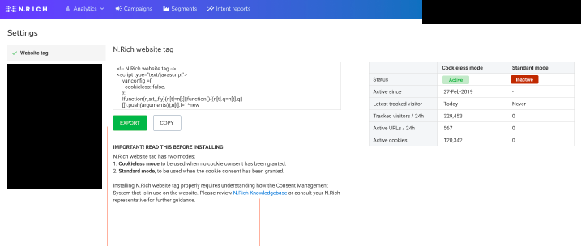

Задание состоит из двух частей:
1. React приложение, для оценки Frontend навыков
2. Теоретические вопросы для оценки навыков разработки API
3. Как оформить результат: лучше оформить в виде приватного git репозитория и расшарить нам доступы.

Как будет оцениваться задание: объективная оценка состоит в том, что должны быть выполнены все пункты перечисленные в задании. Субъективная оценка будет выставлена текущими разработчиками на основании того как именно сделана реализация, что за подходы предложены в теоретических задачах.
Реализовать приложение, которое умеет показывать следующие страницы:
   * / — главная
   * /login — страница ввода логина и пароля
   * /news — страница с новостями (контент новостей должен получаться из API)
   Для наполнения можно в рамках выполнения задания сгенерировать произвольный контент из сотни статичных новостей любым методом, например используя rss фид в качестве источника и положить их в seed
   * /profile — страница с отображением авторизованного username и произвольным текстом, недоступная без авторизации
   
   На сайте, в шапке или подвале реализовать ссылки:
   * На главную (/)
   * Новости (/news). Страница новостей с пагинацией. Новости должны получаться из API (храниться в БД)
   * Профиль (/profile)
      Если пользователь кликает на страницу «профиля» и он не «авторизован» — перекидывать на страницу /login
      Форма входа (/login) принимает данные:
      username: Test
      password: 123456789
      Если введены другие данные, то показывается сообщение: «Имя пользователя или пароль введены неверно». Данные для входа должны проверяться используя вызов к API.
      Если введены корректные данные, то перебрасывать на страницу /profile.
      
Условия выполнения:
1. Проект должен собираться на Webpack, библиотеки устанавливаться через npm или yarn.
2. Задание выполнить на React, все необходимое прокидывать через Redux.
3. Информацию об авторизации пользователя достаточно хранить в localStorage в
   виде true/false.
4. Оформление сделать достаточно комфортным для просмотра в браузере,
   приветствуется использование bootstrap.
   Предложить структуру API, для отображения и работы следующей страницы
   
   На скриншоте макет страницы, используемой для получения website тэга (кода, который устанавливается на страницы наших клиентов). Нужно продумать и приложить структуру API (достаточно описания c примерами, но подойдёт любой формат) для этой страницы.
   Функционал у неё следующий:
   * При заходе на страницу пользователю должен отображаться код website tag (он
      всегда существует)
   *  Справа от кода на страниц отображается таблица со статистикой по текущему
      установленному коду (он может использоваться в 2х разных вариантах, поэтому
      статистика есть по Cookieless и по Standard)
   *  При нажатии на EXPORT должен скачиваться файл с кодом website tag (тот же
      код что отображается в textarea
      Использование DS кода Express приложением
      В рамках многих задач мы используем наработки DS инженеров, которые оформлены в виде cli python скриптов, получающих на вход json/csv файлы и на выходе генерирующие csv файлы с результатами. Скрипты потребляют довольно много CPU / Memory. Стоит задача неким образом получать данные из модели в UI, используя имеющееся Express приложение на бэкенде (оно осуществляет авторизацию / сериализацию и т.п.). Каким образом бы вы решили эту задачу? В задаче нет ограничений по инструментарию
